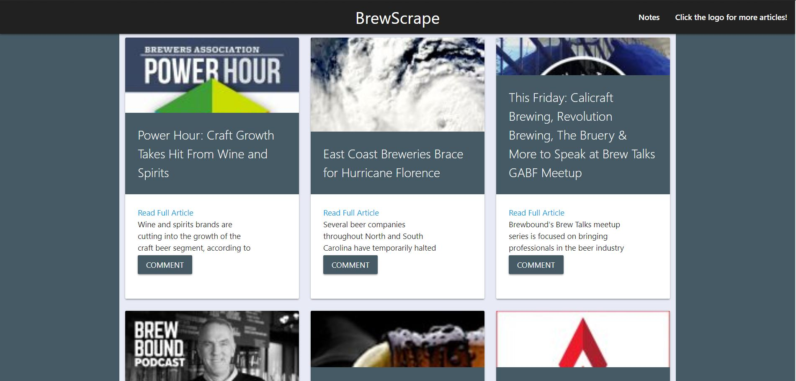

# BrewScrape

BrewScrape News Article:
https://brewscrape.herokuapp.com/

BrewScrape is a Full Stack application using a Scraper, Cherrio, to populate data from www.brewbound.com and allow users to add comments to the stories. A link to the full article is added and will direct the user to the article on Brewbound. Notes can be seen when opening the Note card as well as seen in in the Notes page. 

This app was built for a Georgia Tech homework assignment to demonstrate skill in the following:
-Cheerio, to scrape the data of an existing website
-MongoDB, to store the data from the Cheerio Scrape
-Mongoose, to parse the database and route notes and articles
-Handlebars, to populate this app's scraped data dynamically

Other dependencies are involved on the backend to assist in retrieving, parsing, and logging the data

